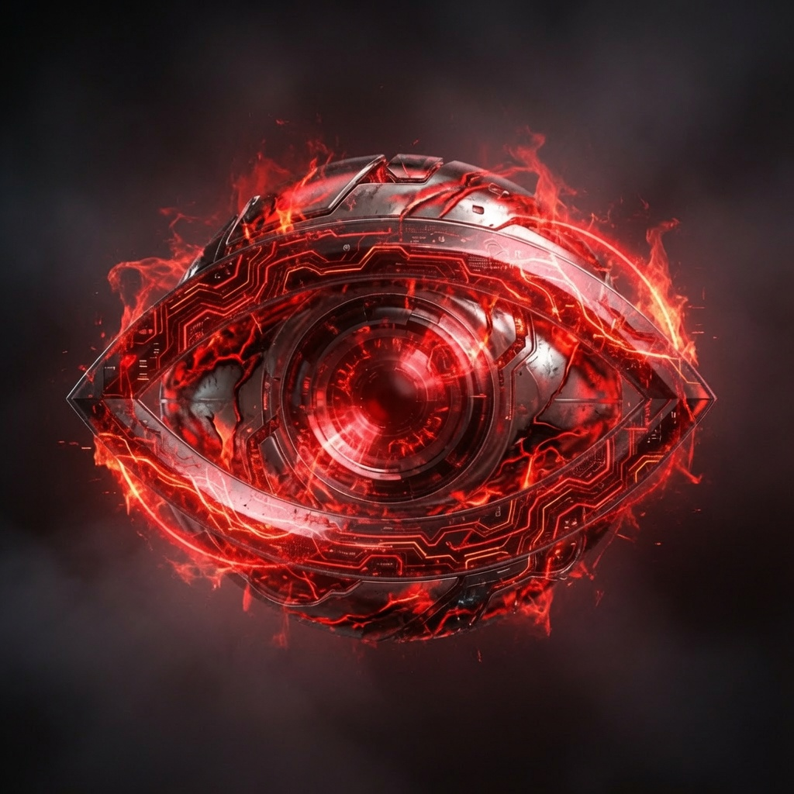

# Whispers In The Void

<table align="center">
  <tr>
    <td align="center" valign="middle">
      
    </td>
    <td align="center" valign="middle" width="220">
      <a href="https://ko-fi.com/laughinginpurgatory">
        
      </a>
      <br/><br/>
      Please support me on KOFI, every bit helps!
    </td>
  </tr>
</table>

<p align="center">
  <strong>A procedurally generated 3D space trading, combat, and exploration game</strong><br/>
  Electron + Three.js · one seeded galaxy · arcade flight · permadeath
</p>

<p align="center">
  <a href="https://github.com/LaughingInPurgatory/whispers-in-the-void/releases/latest"></a>
</p>

---

A desktop space sim with ~**11,000+** planets across ~**3,500** star systems, **100+** ship classes (including exclusive alien hulls), real-time mouse-aim flight and combat, station industry crafting, system security and law standing, and **permadeath**.

New Game starts you in a **Light Runner** at **Terra Prime** (galactic centre, always **Security 6**) with a normal starter loadout.

> **Saves:** Old save games from earlier builds will **not** load or play correctly after major galaxy / systems changes. Start a **New Game** after updating.

## Features

- **One seeded galaxy** — systems, planets, moons, stations, settlements, asteroid fields, and **warp gates** from a fixed canonical seed. Every New Game uses the same map; home is always **Terra Prime** (never a binary/trinary).
- **Whispers** — outer-rim landmark system with a unique trinary sun, a named station, and no ambient hostiles.
- **Textured worlds** — CC0 photo textures under procedural surface detail; gas giants use the same free texture path as other planets. Stars use procedural granulation, tight limb coronas, soft outer glow, flares, and binary/trinary energy rings.
- **100+ ship classes** — hand-crafted archetypes plus a generated roster; hull silhouette, hardpoints, roles, and stats per class. **Explorer** hulls get a **+5%** probe-loot bonus. Some hulls carry **drone bays**. **Mining** hulls (8 models) trade combat for ore holds **200–2000**, tiny cargo (≤40), few/no accessory slots, and low speed/defences.
- **Alien ships & weapons** — four exclusive organic hulls (Void Cyst, Spine Skimmer, Chor Lathe, Zealot Carapace) with alien guns and unique fire SFX. **Never sold.** Craft only if you salvage an **extremely rare** alien blueprint from an alien wreck (the only source of alien tech).
- **Real-time flight and combat** — mouse-aim flight; **LMB** fires every laser hardpoint and **RMB** every launcher (visible wing offsets on multi-mount hulls); boresight weapons; shield/armour/hull; NPC AI. Core systems are busier; the rim is quieter and more alien, with tougher pirates. Pirates may truce with you against aliens.
- **Destroy bounties** — destroying an NPC ship with your weapons pays a **random credit bounty** (toast + wreck loot). Pay scales with hull value and is **higher in lower-security systems** (nullsec pays most). Pirate kills can still improve law standing in high-sec.
- **Combat drones** — hulls with drone bays start empty; buy **Stinger Light** drones from **Shipyard → Armoury** (turrets / launchers / drones listed separately), equip into bays, then launch (**G**) / recall (**H**). They engage only after shots are exchanged.
- **Skills & skillbooks** — pilot skills **0–20** (Character / inventory). Skillbooks are **loot-only** (wrecks, rare alien wreck bonus); read from Inventory. Not sold on markets.
- **System security & law** — security rating **0–6** per system (core safer, rim often lawless). **Law standing 0–10** (start 10): attacking innocents only costs law in Sec 3–6. Low law draws police, station docking refusals, and eventually shoot-on-sight. Police patrol stations; black/white livery with red/blue flashers.
- **Combat FX** — hit sparks/smoke, missile models and contrails, rock explosions, ship death FX; projectiles pass through station/settlement mesh so geometry does not block fire.
- **Wall-clock campaign time** — `simTime` tracks real time while you play; offline catch-up on load (asteroid respawns, cooldowns). Industry jobs use wall-clock timestamps and continue while you fly elsewhere.
- **Crafting / Industry** — rare blueprints from wrecks and probes (1-shot, not sellable); assemble ships, weapons, and accessories at station/settlement bays from stored ore + bay fee. Drag ore/BPs on Industry; ore bay is a side panel. Alien BPs are separate and wreck-only.
- **Every station has a shipyard** — Ships / Armoury / Accessories tabs: buy into **station storage**, sell from storage; loadout and repair (settlements repair only). Role **Bonus** listed under ship stats. Alien tech is craft/equip only (no buy).
- **Accessories** — optional slots (Autopilot multi-hop jumps, Extra Ore Storage ×5 hold, …).
- **Trading economy** — tag-driven prices; **market stock** (Available) per bay; demand and scarcity raise prices. Buy/sell goods and ore use **station storage** (transfer to ship yourself). Outer rim: low-grade ore stays cheap and thin; rare ore is deeper and ~**20%** cheaper.
- **Docking & storage** — dock into a themed bay interior; per-station cargo, ore, parts, ships, weapons, accessories, blueprints, drones. Drag-and-drop ship ↔ bay (cargo/ore/parts on Storage; ore/BPs on Industry).
- **Inventory (I)** — cargo, ore, ship parts, blueprints, **skillbooks**, remote stored assets, industry jobs.
- **Character (F1)** — pilot portrait, law standing, credits, ship summary, **skills**; available anytime in-session.
- **Missions** — bounty, exploration, investigation, probe, and **trade** contracts. Trade: buy a haul (**50–max freighter cargo**, currently up to **700**) at the origin with your credits, jump **≥4** systems to a bay that pays more, then sell — reward scales with quantity. Objectives **auto-complete** when finished (floating toast + chime; no station turn-in). **J** tracks active work; orange rings mark objective systems.
- **Mining** — fire weapons at individual asteroids for ore; finite yield per rock, rarer tiers toward the rim; depleted rocks explode and respawn on the campaign clock. In **Security 0–3**, mining has a **10%** chance per hit to attract pirates (with a cooldown so laser spam cannot stack fleets).
- **Probing** — scan planets, moons, asteroid fields, and stars for survey data, classification reports, and rare **human** blueprints; probe auto-returns after scan.
- **Wrecks & salvage** — loot trade goods, occasional ship parts, rare blueprints; salvaged weapons equip or sell at the armoury. Alien wrecks can drop alien weapons and (rarely) alien blueprints. **F** prefers wreck loot over dock when both are in range.
- **Warp gates & supercruise** — neighbor-linked warp gates; fly into the aperture to jump, emerge from the paired gate. Supercruise to waypoints with standoff arrival. **System Scan (B)** for probe scanning of Spatial Anomalies (alien incursions, datacores).
- **Chase camera** — centered behind the ship; **hold Alt + mouse** free-look (only arms when the mouse moves — bare Alt does not stick free-look), release to snap back.
- **HUD** — status bars, radar, System Scan button, canopy braces, scanlines, tab-target panel; subtle starfield tint from the local sun. **Galaxy map (M)** and **System Scan (B)** open as movable floating panels (geometry remembered). System overview under the radar (clickable with free mouse).
- **Music & SFX** — title/ambient/death music; sample thrusters, weapons, dock, and synthesized combat layers. **Separate Sound Effects and Music** toggles in **Settings** (saved). **Controls** list in Settings (intro + pause). Alien weapons use distinct synth fire sounds.
- **UI Colour** — in **Settings → UI Colour**, retint **accent** (borders, labels, cyan-hinted text) and **panel background** fills (menus, HUD cards, docks — not space or interiors). Changes apply live and auto-save to `settings.json` / localStorage.
- **Windowed app + fullscreen** — default **windowed** with OS frame (**1600×900 outer** including title bar/borders; size/position remembered). **Alt + Enter** toggles native fullscreen. **Settings** on main menu and pause menu. Preferences persist in app `settings.json`.
- **Permadeath** — no respawns; death screen shows killer and law consequence.

## Getting started

```
npm install
npm run dev
```

Launches the app with hot module reloading. Editing `src/renderer/main.js` while `npm run dev` is running resets the current game to the main menu — expected.

### Building

```
npm run build     # electron-vite build
npm run package   # build + electron-builder --dir (unpacked)
npm run make      # build + electron-builder (installer for the current platform)
npm run make:all  # mac + linux + windows installers
```

macOS arm64 only (local test):

```
npm run build && npx electron-builder --mac --arm64 -c.mac.identity=null
```

Artifacts land in `release/` (e.g. `release/mac-arm64/Whispers In The Void.app`). `.blockmap` files are for remote auto-update deltas and can be deleted for local testing.

Prebuilt installers (macOS arm64/x64, Linux AppImage arm64/x64, Windows arm64/x64) are on the [Releases](https://github.com/LaughingInPurgatory/whispers-in-the-void/releases) page.

### Testing

Tests use Node’s built-in runner, colocated as `*.test.js`:

```
node --test src/renderer/game/*.test.js src/renderer/procgen/*.test.js src/renderer/data/*.test.js
node --test src/renderer/game/combat.test.js
```

## Controls

Flight is mouse-aim, toggled with **Space**. While flight mode is on, the pointer is locked for aim; open a menu or press Space again for a normal cursor. After alt-tab, click the canvas or press Space to re-lock. **Settings → Controls** (intro menu or pause) matches these bindings.

| Input | Action |
| --- | --- |
| **Space** | Enter / exit mouse-aim flight mode |
| **Mouse movement** | Aim (yaw/pitch) while flight mode is on |
| **Alt + mouse** | Free-look camera around the ship (release Alt to restore chase) |
| **Alt + Enter** | Toggle fullscreen |
| **Left click** | Fire all laser hardpoints (can hold with RMB) |
| **Right click** | Fire all missile hardpoints (can hold with LMB) |
| **W / S** | Throttle forward / reverse in flight (coasts down when released; reverse capped at 25% of max) |
| **S** | While docked: open/close **Station Services** |
| **A / D** | Strafe left / right |
| **X / Z** | Strafe up / down |
| **Q / E** | Roll |
| **Tab** | Target under crosshair, or cycle nearby contacts |
| **Shift+Tab** | Clear target lock |
| **Ctrl/Cmd + Tab** | Set waypoint on body under crosshair |
| **C** | Toggle supercruise (requires a waypoint) |
| **M** | Galaxy map (flight or docked; search systems, plot routes) |
| **B** | System Scan (probes / Spatial Anomalies) |
| **F** | Warp gate jump (within 2 km) · loot wreck · dock |
| **P** | Hack datacore nodule · launch survey probe |
| **G** | Launch drones (requires installed drones in bays) |
| **H** | Recall drones to bay |
| **I** | Inventory |
| **J** | Missions tracker |
| **F1** | Character sheet |
| **Esc** | Pause / resume |
| **F5** | Quick save |
| **Free mouse** | Click system overview (right) to set waypoints |

Main menu and pause menu both open **Settings**: **Sound Effects**, **Music**, **UI Colour** (accent + panel background), and **Controls**. Preferences (including UI colours) are saved for the next launch.

## Tech stack

- [Electron](https://www.electronjs.org/) (`electron-vite`, `electron-builder`)
- [Three.js](https://threejs.org/) for 3D
- Plain DOM for HUD, menus, and docking UI (in-game dialogs via `gameDialog.js` — no `window.alert`/`prompt`)
- Node’s built-in test runner (`node:test`)
- SFX samples: [Kenney Sci-Fi Sounds](https://kenney.nl/assets/sci-fi-sounds) (CC0)
- Ship/alien PBR textures: [ambientCG](https://ambientcg.com/) (CC0)
- Station bay kit pieces: [Kenney Space Station Kit](https://kenney.nl/assets/space-station-kit) (CC0); selected props from [Quaternius Ultimate Space Kit](https://quaternius.com/packs/ultimatespacekit.html) (CC0)

## License / credit

© Laughing In Purgatory 2026
